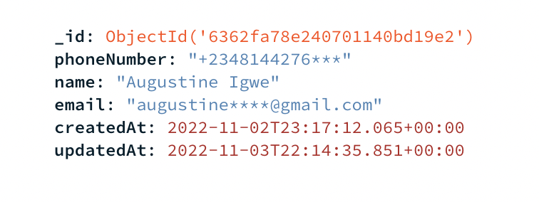

Node API - Natural Cycles

<strong>Description: </strong> An API that creates/updates a user with name and email.

## Introduction

kindly follow the step below to run this project locally on your machine for development process.

<strong>NOTE:</strong> make sure you're on the root backend directory and mongoDB is running <br />

#### Step 1

<strong>Install the app after Git Clone</strong>

```
npm install
```

#### Step 2

<strong>Run the server</strong>

```
npm run dev
```

<strong>NOTE:</strong> This will connect to the local database and server runs on port `7210`<br>

This is how the Database looks like:

